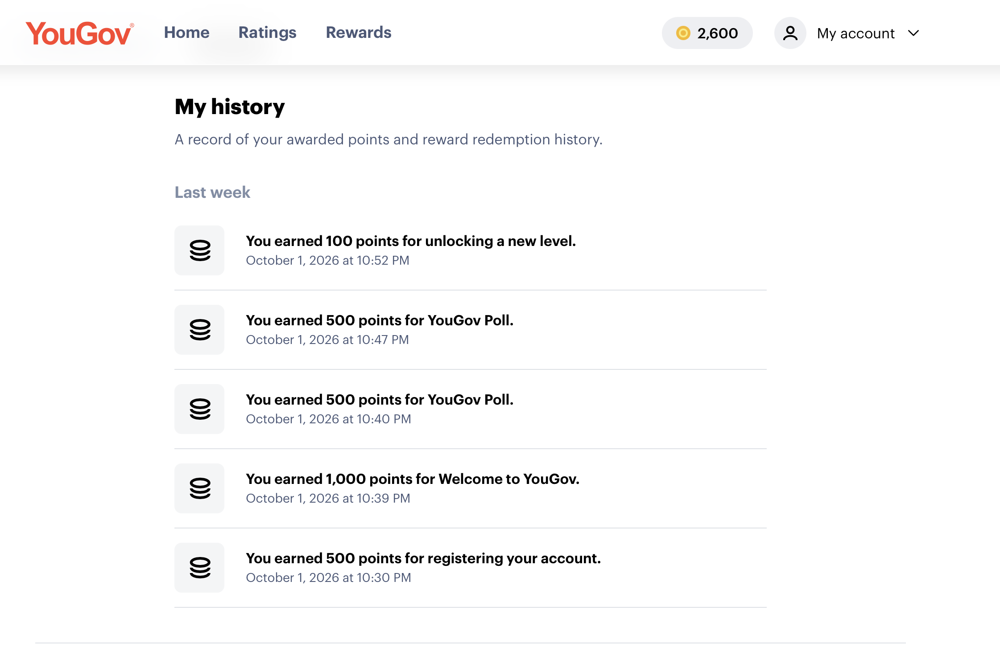
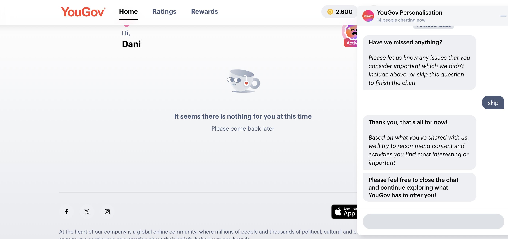

## Overview

For this assignment, I joined YouGov's consumer panel to experience survey research from the respondent's side rather than the researcher's side. Over the course of participating, I encountered several studies with questions that stood out to me as unusual, overly personal, or disconnected from any clear research purpose. Below I present three of those questions, explain why I flagged each one, and close with what this experience taught me about questionnaire design for my own CEP research project.\
\
**My Participation**

To complete this assignment, I registered for YouGov's consumer panel, completed the initial profiling/set-up survey required to activate my account, and was subsequently invited to complete two additional surveys through the platform.

{width="515"}

{width="525"}

I did not capture screenshots of the individual survey questions in the moment, so the specific questions I flagged as unusual are described below from memory rather than shown as images.

## Questions I Flagged

### 1. Household Income

**Why I flagged it:** The study asked me to report my exact household income in a specific bracket, with no explanation of why that figure mattered to the research topic being studied. Income is sensitive financial information, and respondents are often reluctant to disclose it accurately — which means a question like this risks either non-response or inaccurate self-reporting if it isn't clearly tied to the purpose of the study.

### 2. Religious Affiliation and Practice Frequency

**Why I flagged it:** I was asked not just my religious background but how often I practice. This felt invasive given the study gave no indication that religion was relevant to whatever product, brand, or topic was actually being researched. Asking about religious practice without context raises real privacy concerns and can make respondents uncomfortable or suspicious about how the data will be used.

### 3. Political Party Identification and Views on Trump/MAGA Alignment

**Why I flagged it:** This was the most striking example. The survey asked me to identify the political party I align with, share my opinion of Trump, and state whether I consider myself "MAGA." Political attitude questions like this are highly polarizing and personal, and without a stated connection to the study's actual subject, they read as either scope creep (the panel collecting extra demographic/psychographic data for resale) or a genuinely political survey mislabeled as something else. Either way, it's the kind of question that can cause respondents to abandon a survey or answer dishonestly out of discomfort. I wish i had gotten a screenshot but I didnt not realize i need screen shots of each question.

## Lessons Learned for My Research Project

This experience reinforced a few principles I'm carrying directly into my own CEP Farm Store survey and other questionnaire work:

Every question should earn its place by connecting to a specific analytics objective — if I can't explain in one sentence why a question's answer will change a decision or support a hypothesis, it shouldn't be in the survey. Sensitive demographic questions (income, religion, politics) should only appear when they are directly relevant to the research question, and even then, respondents should always be given a "Prefer not to answer" option rather than being forced to disclose — something I already built into my own M02 Qualtrics design after thinking through this exact issue. Sensitive or potentially uncomfortable questions should be placed near the end of a survey, never the beginning, so that a respondent who drops off still provides usable data on the core questions. Finally, as a respondent, vague or unexplained sensitive questions made me trust the survey less and answer less carefully — a reminder that question design affects data quality, not just response rate.

## Conclusion

Participating as a panelist gave me a much clearer sense of where the line is between "necessary context" and "unnecessary overreach" in survey design. I'll be applying the lesson of relevance-first question design as I continue refining the Farm Store digital loyalty program survey for my capstone project.