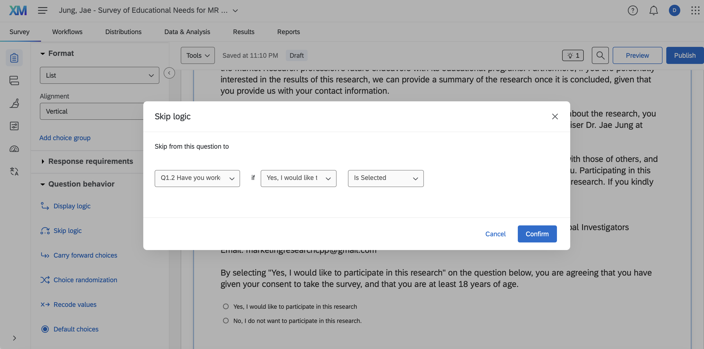
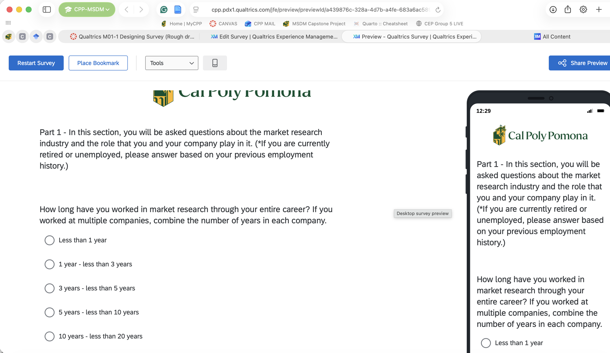
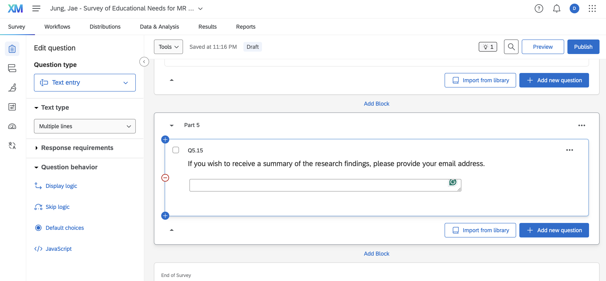
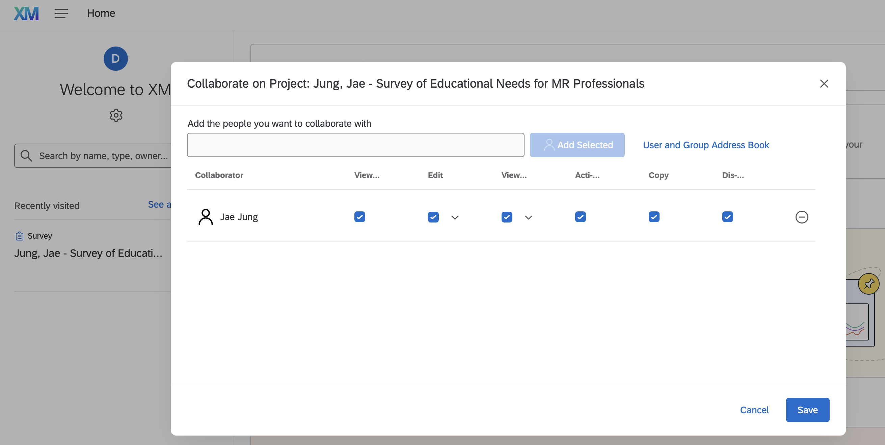

## Overview

This report documents my progress on Qualtrics Assignment M01-1: creating a Cal Poly Pomona-branded Qualtrics account, reviewing the required training material, and beginning a rough-draft Qualtrics version of the *Survey of Educational Needs for MR Professionals*.

## Step 1–3: Account Setup and Upgrade

I created my Qualtrics account through the CBA CCIDM link (not the generic Qualtrics.com signup) so that it carries the Cal Poly Pomona branding and is compatible with classmates' and the professor's accounts. I then tried to upgrade the account using the CBA student code to unlock full functionality beyond the single-survey limit, but this step was no longer needed. I think this upgrade is now built in with CPP license as there was no longer a tap for upgrades listed under my profile.

## Step 4: Qualtrics Training

I reviewed the assigned modules on Qualtrics BASECAMP under "Learn to Use Qualtrics Research Core," covering:

- Configuring Your Project (Building a Survey to Capture X-Data, Customizing Survey Pathways, Customizing Survey Answers)\

I will watch the rest of these when when finalizing this ROUGH DRAFT attempt

- Customizing Your Project (Navigating Participants, Capturing O-Data, Controlling Access)

- Finalizing Your Project (Sharing and Storing Content, Localizing, Styling Your Survey)

## Step 5–6: Building the Rough Draft

I downloaded the Word version of the *Survey of Educational Needs for MR Professionals*. I began transcribing the Word version of the survey into Qualtrics one question at a time, matching each question's numbering, recode values, and any indicated logic. I completed all of Part 1 and have started Part 2. The first question after the intro/consent question — "Have you worked in a Market Research (Consumer Insight / Survey Research) related profession?" — is where I applied skip logic: participants who select a specified answer are routed directly to the end of the survey rather than continuing on.

::: callout-important
## Screenshot: Beginning of Survey

:::

::: callout-important
## Screenshot: Middle of Survey

:::

::: callout-important
## Screenshot: End of Survey

:::

## Step 6-3: Sharing the Project

I shared the project with Professor Jae Jung (Bronco ID `jmjung`), granting edit and view-results access.

::: callout-important
## Screenshot: Proof of Sharing

:::

## Reflection

Given the time constraint, I wasn't able to get as far as I would have liked on this rough draft, but I made sure to submit what I had completed on time rather than delay for a more polished version. The account setup and Qualtrics interface itself were fairly intuitive to work with, and it was interesting to see that the account came pre-branded with Cal Poly Pomona's logo and identity right from the start rather than needing to be customized manually.

I appreciated how straightforward it was to pull together even a rough version of the survey, and I'm looking forward to completing the full build-out. I plan to use this survey to collect real data for our Culminating Experience Project, so getting comfortable with Qualtrics now will pay off directly once we move into that phase.

## Appendix

- **GitHub Repository:** <https://github.com/dmcpp26/ibm6500-assignments>
- **GitHub Pages:** <https://dmcpp26.github.io/ibm6500-assignments/>