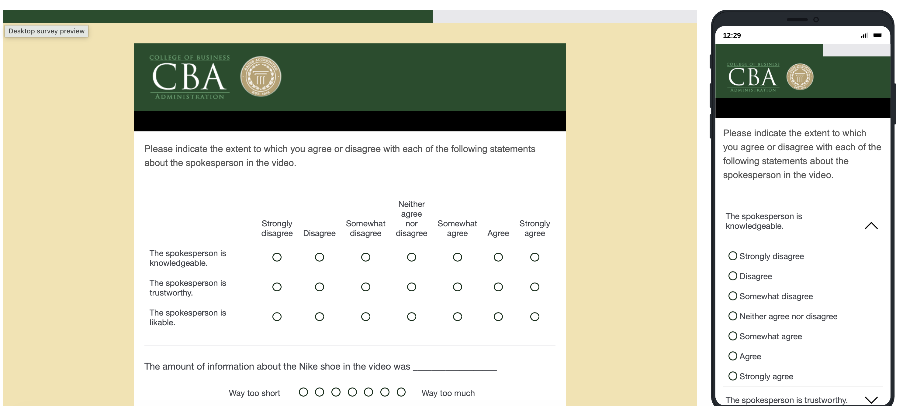
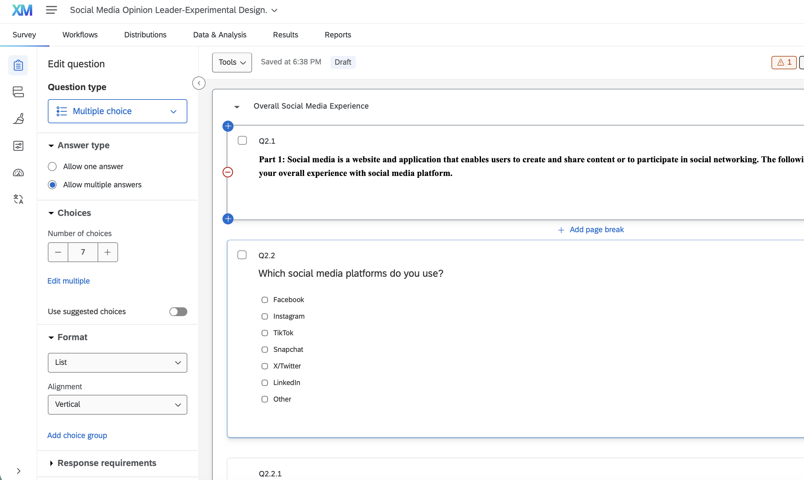
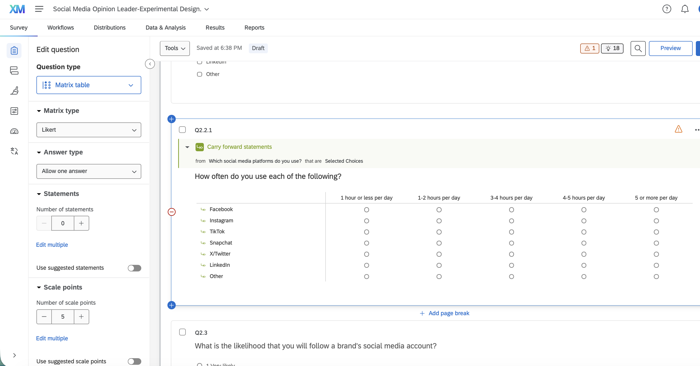
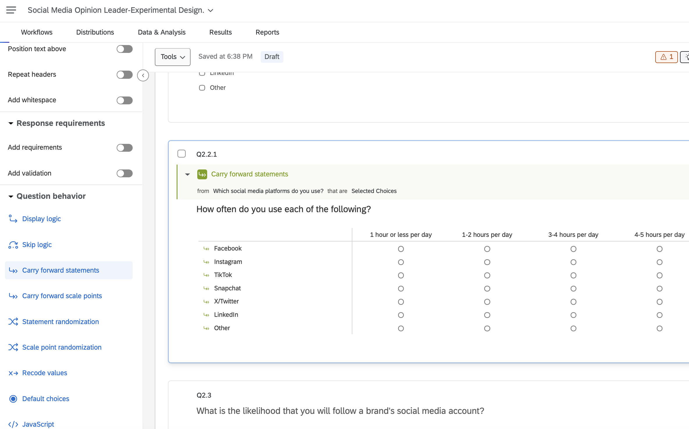
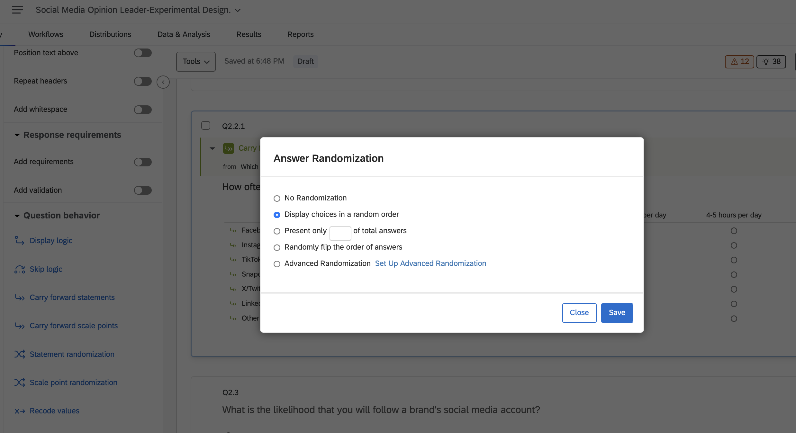
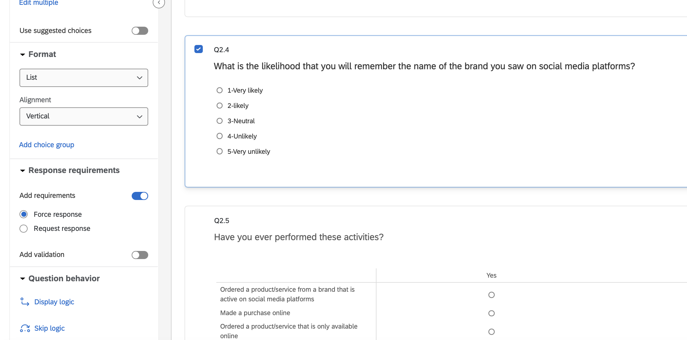

## Overview

This assignment documents the experimental design work completed in Qualtrics for the *Social Media Opinion Leader* study. The survey uses a between-subjects design: participants are randomly assigned to view one of two ad conditions — a social media review or a traditional ad — and are then asked the same follow-up questions regardless of condition. This document covers three tasks: (1) building random assignment into the Survey Flow using the Randomizer and Branch Logic functions, (2) revising Q2.2 to capture social media usage rate per platform rather than as a single combined measure, and (3) three additional improvements made to the questionnaire.

## Task 1: Random Assignment via Randomizer and Branch Logic

To scientifically compare the two ad types, participants must be split into two equivalent groups that differ only in which ad they see. This was implemented in the Survey Flow as follows:

- A **Randomizer** element was inserted immediately after the `id` Embedded Data field, set to evenly present one of two branches.
- Each branch sets an `Ad Type` Embedded Data value (`reviewer` or `ads`).
- Two **Branch If** elements route participants to `Show Block: social_media_review` or `Show Block: ads` based on their assigned `Ad Type`.

{width="614"}\
\[Screenshot 1 — full Survey Flow, top half showing Embedded Data + Randomizer\]

{width="622"}\
\[Screenshot 2 — Survey Flow, Branch If elements and routed blocks\]

{width="613"}\
\[Screenshot 3 — Preview mode run multiple times, confirming both ad conditions appear\]

## Task 2: Revising Q2.2 to Capture Per-Platform Usage

The original Q2.2 asked respondents to report their overall social media usage as a single combined figure, which made it impossible to tell how much time was spent on any individual platform.

**Before:**

{width="619"}\
\[Screenshot 4 — original Q2.2, single combined-usage question\]

**After:** Q2.2 was converted into a multi-select question asking which platforms respondents use, allowing more than one answer to be checked. A follow-up Matrix Table question then asks usage frequency, with its rows populated using the **Carry Forward Choices** function pulling the selected platforms from Q2.2 — so each respondent only sees frequency rows for the platforms they actually use.

{width="694"}\
\[Screenshot 5 — revised Q2.2 as multi-select, with the options panel showing "Multiple Answer" selected\]

{width="703"}\
\[Screenshot 6 — follow-up Matrix Table question\]

{width="762"}\
\[Screenshot 7 — Carry Forward Choices configuration panel\]

## Task 3: Additional Questionnaire Improvements

Three further changes were made to improve the quality of the questionnaire:

### Improvement 1: randomized answer-choice order

*{width="625"}\
Randomize the answer-choice order on attitude/Likert questions (removes order-effect bias where people default to top options)*

### Improvement 2: added "Prefer not to answer" option

{width="636"}

*Prefer not to answer" to sensitive demographic questions (reduces forced non-response bias)*

### Improvement 3: added attention-check item - force response

{width="569"}*\
Add an attention-check item in one of the longer blocks (data-quality control).*

## Appendix

- GitHub Repository: \[https://github.com/dmcpp26/ibm6500-assignments\]
- GitHub Pages (Published HTML): \[https://dmcpp26.github.io/ibm6500-assignments/\]